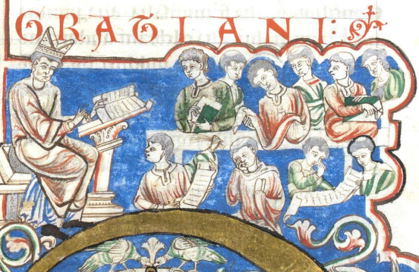

# ICMCL17
Proposal for 17th International Congress of Medieval Canon Law

[Call for Papers -- Seventeenth International Congress of Medieval Canon Law (ICMCL) Canterbury, UK, 7-13 July 2024](https://www.themedievalacademyblog.org/call-for-papers-seventeenth-international-congress-of-medieval-canon-law-icmcl-canterbury-uk-7-13-july-2024/)

The textual history of Gratian's Decretum is now understood well
enough to enable researchers to comparatively read first-recension,
second-recension, and vulgate versions of the text to identify
evolutionary changes in its doctrine. Specific developments can be
identified by close reading well-chosen selections from the text
(e.g., Pennington, "The Law's Violence against Medieval and Early
Modern Jews"). However, a systematic search for such doctrinal
developments is best conducted with computational assistance, taking
advantage of recent advances in the application of large language
models to natural language processing tasks. Using the PIE lemmatizer
in conjunction with the LASLA Latin models, it is possible to
lemmatize samples reflecting different compositional stages of
corresponding sections of the Decretum and to compare the results,
isolating lemmas unique to specific stages in the development of
the text. Distinctive vocabularies of different compositional stages
surfaced by this method then provide a roadmap for close reading
in context.

---
The default branch is `main`!

`python3.7 -m venv pie`  
`cd pie`  
`source ./bin/activate`  
`pip install --upgrade pip`  
`pip install nlp-pie`  
`pip install pie-extended`  
`pie-extended download lasla`  
`pie-extended install-addons lasla`  
`pie-extended tag lasla your_file.txt`  

---

+ installed Visual Studio Code 1.84.2
+ installed Python 3.7.9
+ upgraded Python to 3.11.7

