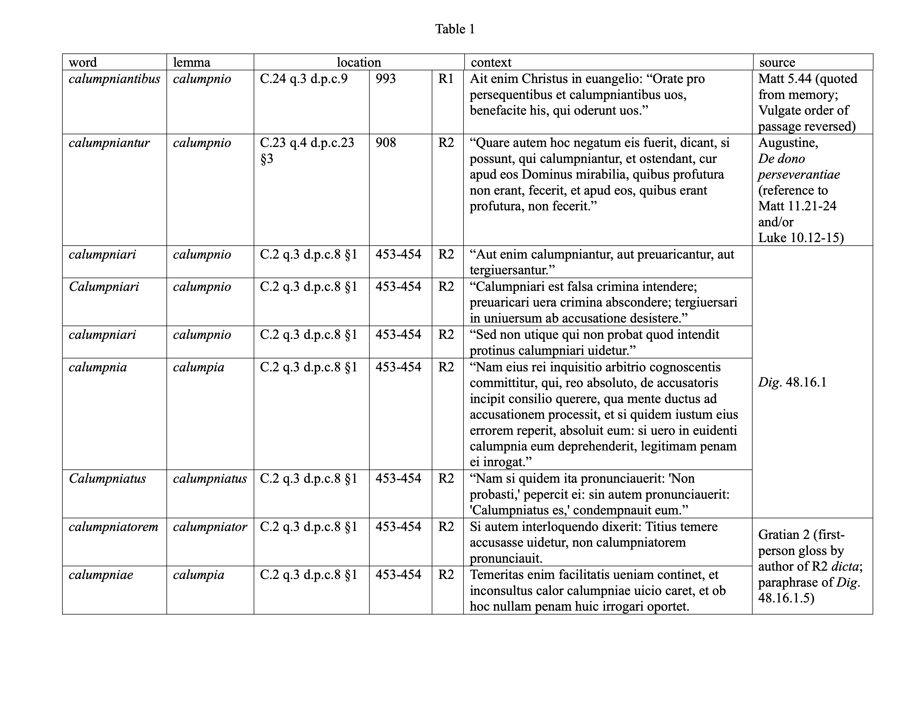

This paper presents work that is part of a larger project to enhance
the effectiveness of close reading of medieval texts, Gratian's
*Decretum* in particular, using computational assistance. The Digital
Humanities community uses the term "distant reading" to describe
this kind of computational assistance, emphasizing both its connection
to, and its contrast with, traditional close reading. Each project
that uses a distant or machine reading approach aims to answer
different questions and therefore uses different tools and techniques.

The original project from which the current work grew was concerned
with the question of the authorship of the case statements and the
first- and second-recension *dicta* in Gratian's *Decretum*, including
the *dicta* in *de penitentia*. It employed stylometric authorship
analysis using a statistical technique from computational
linguistics---principal component analysis of the frequencies of
commonly occurring function words---to obtain its results. Its
conclusion was that the case statements were written by a single
author who was not the author of the *dicta* either in the first
or second recensions or in *de penitentia*. Results from stylometric
analysis for authorship of the *dicta*, however, were not consistent
with either the one-author theory championed by Kenneth Pennington
or the two-author theory championed by Anders
Winroth.[@pennington_biography_2018] [@winroth_making_2000, 175-192]
Instead, the results suggested, but did not conclusively prove,
that both the first- and the second-recension *dicta* were the work
of multiple authors.[@evans_distant_2022]

In contrast, the current work concerns changes in the teaching or
doctrine of the *Decretum* between the first and second recensions
as indicated by the use of distinctive vocabulary in the *dicta*
of the two recensions. It employs another computational linguistic
technique, lemmatization, using the PIE lemmatizer and a large
language model (LLM) trained on the corpus of lemmatized and tagged
Latin text created by the Laboratoire d'Analyse Statistique des
Langues Anciennes (LASLA) at the University of
Liège.[@manjavacas-etal-2019-improving] [@verkerk_lsl_2020]
The two projects share a common data set. The original project
relied on a very carefully prepared data set of the texts of the
case statements and the first- and second-recension *dicta*.[^5]
The current work uses the same data set. The overarching goal of
the two projects is the same---to use computational distant reading
techniques to enhance close readings of the *Decretum*---but the
two projects attempt to answer different questions using different
tools and techniques.

This is not my first attempt to make progress on the problem of
computationally identifying topics added to the *dicta* between the
first and second recensions. Around 2012, there was tremendous
enthusiasm in the Digital Humanities community for a technique
called unsupervised topic modeling and in particular for a
topic-modeling tool called the MAchine Learning for LanguagE Toolkit
(MALLET).[@McCallumMALLET] Inspired by Pennington's observation
that most passages in the *Decretum* dealing with the legal status
of Jews, particularly those dealing with forced conversion, were
introduced only in the second recension,[^7] I hoped to use MALLET
to identify other new topics added in the second recension. The
approach was to topic model the first- and second-recension *dicta*
together, then separately, in order to show which topics were left
when the first recension topics were subtracted. (It would not be
enough to topic model just the second-recension *dicta* because
many of the topics present in the second recension *dicta* are also
present in the first-recension *dicta*.) This approach was simple
in concept but prohibitively difficult in practice, for two reasons:
first, because of the difficulty in determining the number of topics
to look for, a necessary precondition for unsupervised topic modeling,
and, second, because there was no obvious way to
subtract topics.

For the discussion that follows, I am defining
"first-recension *dicta*" as the text of the *dicta*
listed in the appendix of Winroth's *The Making of Gratian's
Decretum*, and I am defining "second-recension *dicta*" as the words
in the *dicta* as they appear in the Friedberg edition
when the words in the *dicta* in Winroth's appendix
have been taken away. D.54 d.p.c.23 is a good example, Winroth's
appendix indicates that only the first sentence of the *dictum*
appears in the first recension. Therefore, the first sentence of
the *dictum* is assigned to the first recension text sample:

> *Ecce, quomodo serui ad clericatum ualeant assumi, uel quomodo
non admittantur.* Liberti quoque non sunt promouendi ad clerum,
nisi ab obsequiis sui patroni fuerint absoluti. Unde in Concilio
Eliberitano:

The remainder of the *dictum* is assigned to the second recension
text sample:

> Ecce, quomodo serui ad clericatum ualeant assumi, uel quomodo non
admittantur. *Liberti quoque non sunt promouendi ad clerum, nisi
ab obsequiis sui patroni fuerint absoluti. Unde in Concilio
Eliberitano:*

Using this definition, the first- and second-recension *dicta*
contain 56,713 and 14,255 words respectively.

Once it became clear that unsupervised topic modeling using MALLET
would not be an effective way to identify topics added to Gratian's
*Decretum* between the first and second recensions, the most promising
alternative approach to the problem appeared to be using lemmatization
to identify distinctive vocabulary as an indicator pointing to new
ideas added between the first and second recensions. When working
in a highly inflected language like Latin, using words as the
indicators pointing to corresponding ideas is not sufficiently
precise. As an example to be examined more closely later in
this paper, the noun *calumnia* has seven unique declined forms. A
regular first conjugation deponent verb like *calumnior*, *calumniari*,
*calumniatus* has 120 conjugated forms, approximately eighty of
which are unique, not including participial forms. Therefore, if
we want to use distinctive vocabulary as a basis for determining
whether or not an idea or topic is present in a Latin text, we need
to lemmatize every word form we encounter---that is, reduce it to
its dictionary headword or *lemma*. Once text samples for the first-
and second recension *dicta* have been reduced to corresponding
lists of lemmas, those lists can be compared to generate three
further lists, (i) of lemmas that appear in both the first- and
second-recension *dicta*, (ii) of lemmas that are unique to the
first-recension *dicta*, and (iii) of lemmas that are unique to the
second-recension *dicta*. It is the list of lemmas unique to the
second-recension *dicta* that is relevant to the problem of topics
added to the *Decretum* in the second recension.

The results of initial experiments with the Classical Language
Toolkit (CLTK), built on top of the Python Natural Language Toolkit
(NLTK) and the best lemmatization tool available at the time, were
not encouraging.[^8] The first- and second-recension *dicta* might
reasonably be expected to include a few hundred unique lemmas, but
CLTK reported many thousands (over four thousand for the first-recension
*dicta* alone), the overwhelming majority of which were false
positives. Clearly, lemmatization was not ready for the purpose of
this project, and that remained the case for many years, from 2014
through 2020.

In 2021, Mike Kestemont made me aware of the PIE lemmatizer.
Kestemont is a researcher at the University of Antwerp specializing
in medieval Latin and Middle Dutch literature and a leading
figure in the field of computational text analysis. PIE is not an
application or program---the user does not simply type a command
or click a button and get lemmatized text as output. Instead, PIE
and PIE Extended[@thibault_clerice_2020_3883590] are a collection
of libraries, packages, and toolkits that provide an extremely
versatile set of software building blocks that can be called upon
to perform a wide range of natural language processing functions,
like part-of-speech tagging or lemmatization, in a Python program.[^10]
They are based on large language models (LLMs) trained using machine
learning techniques on annotated corpora of texts in the target
language. In this case, PIE uses a model trained on the LASLA corpus
of 2.5 million words or tokens of classical Latin, each annotated
with lemma, part of speech, and other morphological and syntactic
information. Once the PIE lemmatization environment had been set
up, I wrote a Python program that used PIE first to create separate
lists of every lemma found in the first- and second-recension *dicta*
and then to compare the two lists to identify lemmas that appear
only in the second-recension *dicta*. The program produced a list
of 725 unique lemmas present only in second-recension *dicta*.[^11]

An understanding of whether an idea or topic is present in, or
absent from, a selection of text can almost never be arrived at
based on the presence or absence of a single lemma. Instead, human,
as opposed to machine, readers must look for the presence of families
of related lemmas to indicate the presence of an idea or topic in
a selection of text. In reviewing the list of the 725 lemmas unique
to the second-recension *dicta*, one such family, all related to
the concept of calumny, stood out. This family will
be the exemplar of what new computational techniques are able to
reveal about the evolution of the text and ideas of the *Decretum*.

<!--
Calumny is a promising lead because we know that between 1140 and
1234, what we think of as the classical period in the history of
medieval canon law, the concept of calumny took on a significance
and a formal legal meaning that was derived from but was considerably
more precise than its previous general use in Christian discourse.
  -->

Calumny is a promising lead because we know that it was a topic to
which canonists gave considerable attention before and during the
classical period in the history of medieval canon law between 1140
and 1234. They concentrated their interest on the oath of
non-calumniation (*de calumnia vitanda*), which came to be required
of almost all litigants at the onset of legal proceedings in
ecclesiastical courts. The oath had been a normal part of Roman
civil procedure in the age of Justinian but disappeared from use
in the West along with the rest of Justinianic Roman law in the
Early Middle Ages. It reemerged in the West in the second quarter
of the eleventh century. For example, the judge in a 1029 case from
the bishop's court in Ravenna asked first the plaintiff's notary
on behalf of his client and then the defendant to take the oath.
Both declined to do so. It is noteworthy that this episode took
place almost half a century before the 1076 Placitum of Marturi
(Poggibonsi), usually taken as signaling the revival of Justinianic
Roman law in the West. By the second quarter of the twelfth century,
use of the oath was widespread enough to make it an active
topic of discussion during the reigns of Honorius II (1124-30),
Innocent II (1130-1143), and Eugenius III (1145-1153). The contested
issues were (i) who should be required to take the oath (some
litigants, all litigants, advocates on behalf of litigants, or
advocates as well as litigants), and (ii) the kinds of cases in
which litigants or advocates or both should be required to take the
oath (Eugenius treated cases concerning tithes, possession of
churches, and "spiritual affairs" as exceptions to a general
requirement to take the oath). The general trend over the course
of the second half of the century was in the direction of extending
the requirement and "[b]y the close of the twelfth century the
calumny oath had become a normal element of canonical civil procedure
and might be required in most contested cases, at least if one of
the parties insisted upon it."[@brundage_calumny_2004,795-799]

The idea of calumny is used in two distinct senses in the *Decretum*.
The first is general and biblical, and is derived from sayings
attributed to Jesus in which a relationship between calumny and the
Mosaic prohibition against bearing false witness is implied though
not directly stated. This general and biblical sense is also the
one used in many of Gratian's patristic material sources. The second
is specific and legal, and is derived from Justinianic Roman law.
Where the idea of calumny is invoked in the *dicta* of the first
recension of the *Decretum*, it is exclusively in the first sense;
where it is invoked in the *dicta* of the second recension, it is
predominantly, though not exclusively, in the second sense.
Interestingly, Gratian does not discuss the oath *de calumnia
vitanda* in either the first or the second recensions.

We should expect to see at least three Latin lemmas associated with
the concept of calumny: the deponent verb *calumnior*, *calumniari*,
*calumniatus* including participial forms like *calumnians* and
*calumniatus*; the feminine noun *calumnia* corresponding to the
idea of calumny in the abstract; and the masculine noun *calumniator*.

PIE does report three lemmas from this family among the 725 unique
to the second-recension *dicta*: *calumnia*, *calumniator*, and
*calumniatus*. It does not report the lemma *calumnior* because,
as we shall see, the word *calumniantibus* appears in a first-recension
*dictum* and, therefore, the verb form is not included in the list
of lemmas unique to the second-recension *dicta*.[^13]

The results reported by PIE are summarized in Table 1 below. The
columns indicate:

+ the form of the word as it appears in the Friedberg edition,

+ the lemmatized form of the word returned by PIE,

+ the standard citation for the unit in which the word appears
(e.g., C.2, q.3, d.p.c.8),

+ the Friedberg edition column number in which the word appears,

+ whether the word appears in the first or second recension (e.g.,
R1 or R2),

+ the context (sentence) in which the word appears,

+ and the source of the text in which the word appears.

{width=100%}

When we turn our attention to the substantive treatment of the topic
of calumny in the *dicta*, there is variation in terms of the legal
sophistication with which the concept is handled, moving generally
in the direction of greater technical precision and sophistication.
(I say "generally" because, while we can assume the first recension
*dicta* were written before the second recension *dicta*, we do not
have enough information to speculate about the temporal relationship
among the second recension *dicta*.)

The concept of calumny makes its initial appearance in the form of
a slightly misquoted scriptural reference in the first-recension
*dictum* C.24 q.3 d.p.c.9:

> Ait enim Christus in euangelio: "Orate pro persequentibus et
calumpniantibus uos, benefacite his, qui oderunt uos."

The treatment of the concept in the second-recension *dictum* C.23
q.4 d.p.c.23 §3 is in a similar spirit, although there the scriptural
allusions are mediated through a patristic source, Augustine's *De
dono perseverantiae*, a treatise on predestination.

> "Quare autem hoc negatum eis fuerit, dicant, si possunt, qui
calumpniantur, et ostendant, cur apud eos Dominus mirabilia, quibus
profutura non erant, fecerit, et apud eos, quibus erant profutura,
non fecerit."

Both of these *dicta* use the words associated with the concept of
calumny in the same general, non-technical, sense they had in the
first millennium of Christian discourse.

That is not the case in the second recension *dictum* C.2 q.3 d.p.c.8
§1. Here we see a series of quotations from *Dig.* 48.16.1-5
containing seven occurrences of five words,[^14] corresponding to
all four of the expected lemmas related to the concept of calumny.
It is of obvious interest that the quotations in this *dictum* are
from Justinianic Roman law rather than from scriptural or patristic
sources.

Most interesting of all is that this section of the *dictum*
concludes with a first-person saying by the author of the
second-recension *dicta* (or at least of this *dictum*) in effect
glossing the term *calumniator*.

> Si autem interloquendo dixerit: Titius temere accusasse uidetur,
non calumpniatorem pronunciauit. Temeritas enim facilitatis ueniam
continet, et inconsultus calor calumpniae uicio caret, et ob hoc
nullam penam huic irrogari oportet.

Gratian's own intervention is extremely modest---he does little
more than paraphrase an opinion attributed to Papinian in *Dig*.
48.16.5. Nevertheless, the *dictum* shows progress toward greater
legal sophistication in the sense that the discussion draws on
resources from Justinianic Roman Law.

### Conclusions

The long-term goal of this project has been to find a way to
use computationally-enabled distant reading---"reading machines"
in the words of Stephen Ramsay[@ramsay_reading_2011]---to efficiently
direct the attention of scholars to specific sites in the text of
Gratian's *Decretum* where new topics added between the first and
second recensions are likely to be found by close reading.

I think this effort was successful as a proof of concept. Using the
PIE lemmatizer in conjunction with the LASLA Latin large language
model (LLM) to systematically lemmatize every word in the first-
and second-recension *dicta* and then to list all of the lemmas
that *do* appear in the second-recension *dicta* but *not* in the
first-recension *dicta* drew attention to a family of lemmas
(*calumnia*, *calumniator*, and *calumniatus*) that indicated the
treatment of a canonically significant concept, calumny. On close
reading, the sites in the text of the *dicta* identified by the
results do show a meaningful development over time in the
vocabulary of Gratian's *dicta* and to that extent in the teaching
or doctrine of the *Decretum* on this topic. The detection of calumny
as a topic that the authors of the *Decretum* developed in a
significant way in the second recension demonstrates the usefulness
of lemmatization as a technique for investigating this type of
question.

Calumny was the most obvious topic (at least to me), and I was
surprised that there were no other such immediately obvious
conceptually related families of lemmas in the results, although I
strongly encourage interested readers to examine the complete list
of lemmas unique to the second-recension *dicta* for themselves.[^17]
As previously indicated, there is limited value in the results of
machine reading by itself. The real value of the results of machine
reading lies in the patterns that researchers see in them.

Is it enough? No.

I have tried to emphasize that the project I have discussed in this
paper is very much a work in progress and that the results, although
interesting, are limited to the *dicta* and therefore should not
be taken as anything more than a proof of concept.

An unsystematic search through the Monumenta Germaniae Historica
(MGH) e-text of the Friedberg edition that was created for
the *Wortkonkordanz zum Decretum Gratiani* indicates that there are
occurrences of forms of the words I have been focusing on---*calumnia*,
*calumnior*, and *calumniator*---in the rubrics and canons.[^18] A
thorough approach to systematically identifying new
topics added to the *Decretum* between the first and second recensions
will therefore require a data set that includes the rubrics and
canons with their inscriptions as well as the *dicta* and case
statements.

Ideally, such a data set would be in the form of a new e-text in
TEI-P5 XML format incorporating texts from both the old Friedberg
edition and the new Winroth edition-in-progress of the first
recension. This is where the scale of the undertaking becomes really
challenging. Even without the overhead of structuring the data set
as a TEI-P5 document, I spent approximately twelve person-weeks on
corpus preparation for the *dicta* and the case statements as part
of my dissertation project. Since the word count of the canons is
roughly five times that of the *dicta*, one person-year is not an
unreasonable initial estimate for corpus preparation for a comparable
data set for the canons.

The work I have discussed in this paper is based on a highly
customized version of a twentieth-century e-text of a nineteenth-century
print edition of the *Decretum*. The MGH e-text of the Friedberg
edition is the indispensable free resource without which none of
my work, and I suspect the work of many others, would be possible.
But like so many free things, someone paid a great deal of money
to make it free. However, the MGH e-text is a resource that because
of its archaic format is approaching the end of it useful life. If
we want to continue to advance our understanding of Gratian's
*Decretum* with the help of electronic resources, we need to invest
time, effort, and grant funding into a twenty-first-century electronic
text, or better still an electronic edition, of Gratian's *Decretum*.

[^5]: This research could usefully be expanded to include the rubrics
and canons, and I have made preparations to do so. The work required
to expand the corpus to include the canons themselves would require
grant funding.

[^7]: @pennington_laws_2013; and @pennington_gratian_2014.

[^8]: Python is a widely-used general-purpose programming language.
According to one frequently-cited industry metric, the [TIOBE
Index](https://www.tiobe.com/tiobe-index/), Python is the most
popular programming language worldwide as of June 2026. Python
provides powerful features for performing operations on textual
data.

[^10]: I would like to acknowledge Jake Bayon, an undergraduate
Computer Science student at the University of San Diego, who set
up the PIE lemmatization environment as an independent study project
with me during the Spring 2024 semester and who learned something
about Gratian in the process. PIE can only be installed with the
2019 Python 3.8 release---the current release as of June 2026 is
Python 3.14.

[^11]: The 728 lines of program output included three numbers, which
I discarded. The complete list is available at
[https://github.com/decretist/ICMCL17/blob/main/results/lemmas.txt](https://github.com/decretist/ICMCL17/blob/main/results/lemmas.txt).

[^13]: PIE reports the lemmas as *calumpia*, *calumniator*, and
*calumpniatus*. *calumpia* is almost certainly a typo in the LASLA
Latin language model for *calumpnia*. PIE reports the lemma of
*calumpniantibus* as *calumpnio*. The spelling is consistent with
the orthographic conventions of the Friedberg edition, from which
the text samples of the first- and second-recension *dicta* are
ultimately derived.

[^14]: *calumpniari*, *calummpnia*, *calumpniatus*, *calumpniatorem*,
and *calumpniae*.

[^15]: @winroth_making_2000, 153-156.

[^17]: The complete list of 725 lemmas unique to the second recension
*dicta* is available from my GitHub repository for the Seventeenth
International Congress of Medieval Canon Law at
[https://github.com/decretist/ICMCL17/blob/main/results/lemmas.txt](https://github.com/decretist/ICMCL17/blob/main/results/lemmas.txt).

[^18]: @reuter_wortkonkordanz_1990 For example, see the rubrics for
D.9 c.9 (R1), D.87 c.9 (R2), C.3 q.1 c.6 (R1), and C.5 q.5 c.8 (R2).

